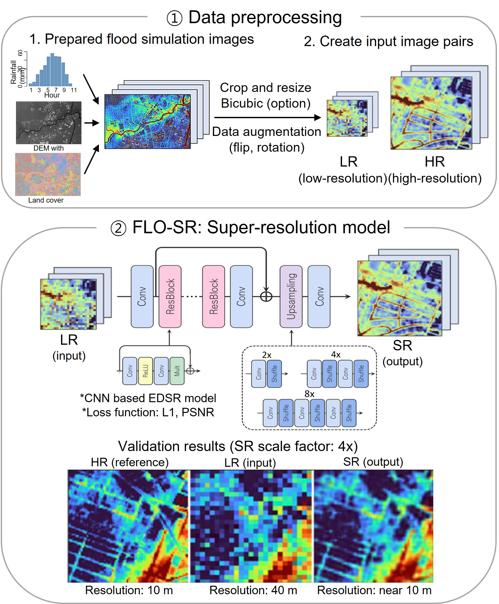

# Deep learning-based urban flood super-resolution model

This repository accompanies the paper [**FLO-SR: Deep learning-based urban flood super-resolution model**] (https://www.sciencedirect.com/science/article/pii/S0022169425008674) (Hyeonjin Choi, Hyuna Woo, Minyoung Kim, Hyungon Ryu, Jun-Hak Lee, Seungsoo Lee, and Seong Jin Noh) and managed by the Hydrology and Water Resources Lab (Noh Lab, https://cyber-hydrology.github.io/) at Kumoh National Institute of Technology.




In this repository, we provide
* Demo & Training code (code)
* Datasets we used (data)

## Setup to run the code locally

Download this repository either as zip-file or clone it to your local file system by running

```
https://github.com/cyber-hydrology/FLO-SR-flood-super-resolution-model.git
```

### Setting up the Python environment
This model must be performed in TensorFlow version 2.15.0 and simply run ipynb code in juputer notebook.
Get the required library by running the first code fragment in ipynb code.

If you have a CUDA-capable NVIDIA GPU. This is recommended if you want to train/evaluate the FLO-SR on your machine, but not strictly necessary.

## Data and Code

### Required Downloads
First, you need the flood data set to run the model. This dataset can be downloaded at the data folder.

### Running notebooks
Set a location in ipynb file.
In your terminal, go to the project folder and start a jupyter notebook server by running

```
jupyter notebook
```


